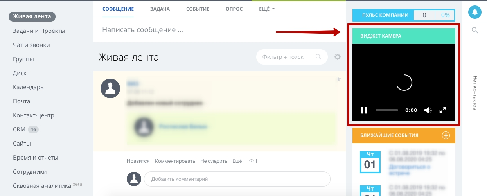

# Модуль webcam.widget для Битрикс24

* Модуль позволяет воспроизводить видео в качестве виджета 



```
# Пример использования компонента
$APPLICATION->IncludeComponent(
    "vendor:webcam.widget",
    ".default",
    [
        "UNIQUE_CODE" => "widget_120921",
        "WEBCAM_URL" => "",
        "WEBCAM_POSTER_URL" => "",
        "VIDEO_HEIGHT" => "3",
        "VIDEO_WIDTH" => "4",
        "COMPONENT_TEMPLATE" => ".default"
    ],
    false
);

UNIQUE_CODE - уникальный код, для подключения нескольких компонентов на странице
WEBCAM_URL - ссылка на потоковое видео
WEBCAM_POSTER_URL - изображение по умолчанию в момент загрузки видео 
VIDEO_HEIGHT - соотношение сторон - высота
VIDEO_WIDTH - соотношение сторон - ширина
COMPONENT_TEMPLATE - шаблон компонента по умолчанию
```

* define('INSTALL_MODULE_ID', 'nm.webcam.widget');
```
nm.webcam.widget - название модуля
```